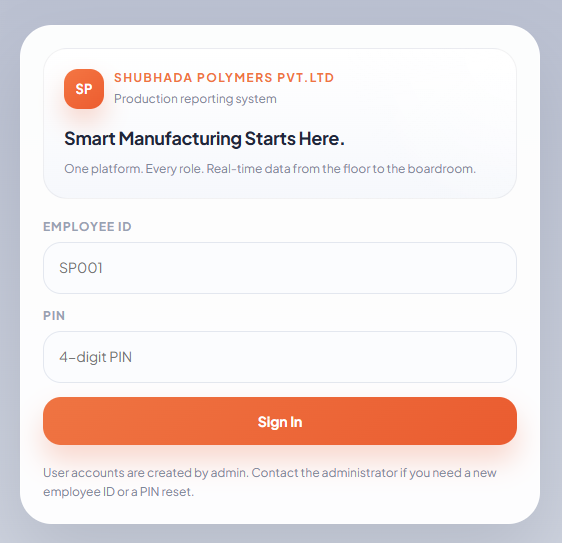
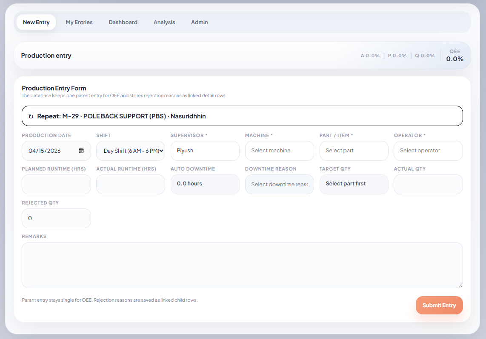
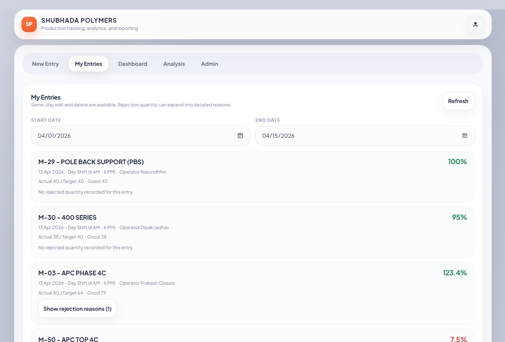
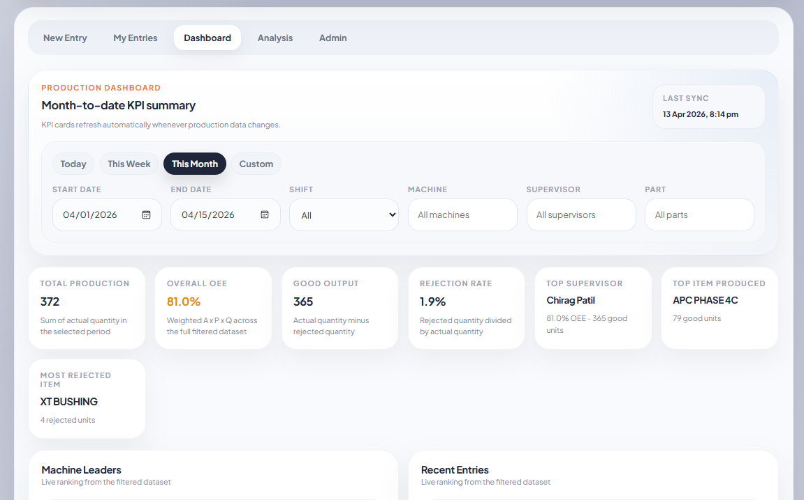
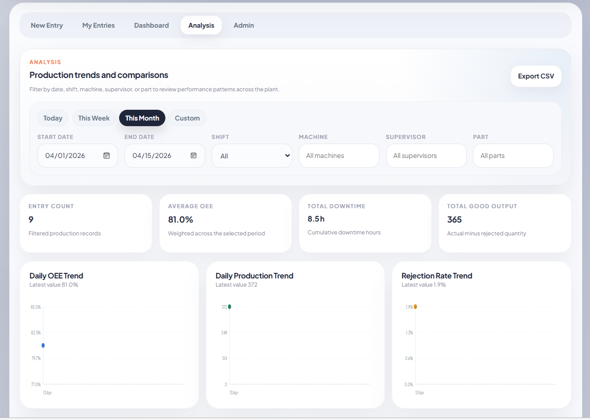
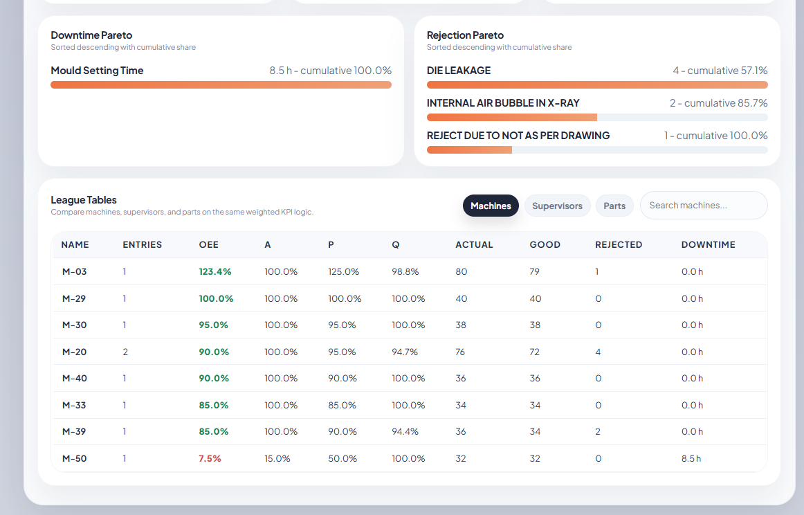
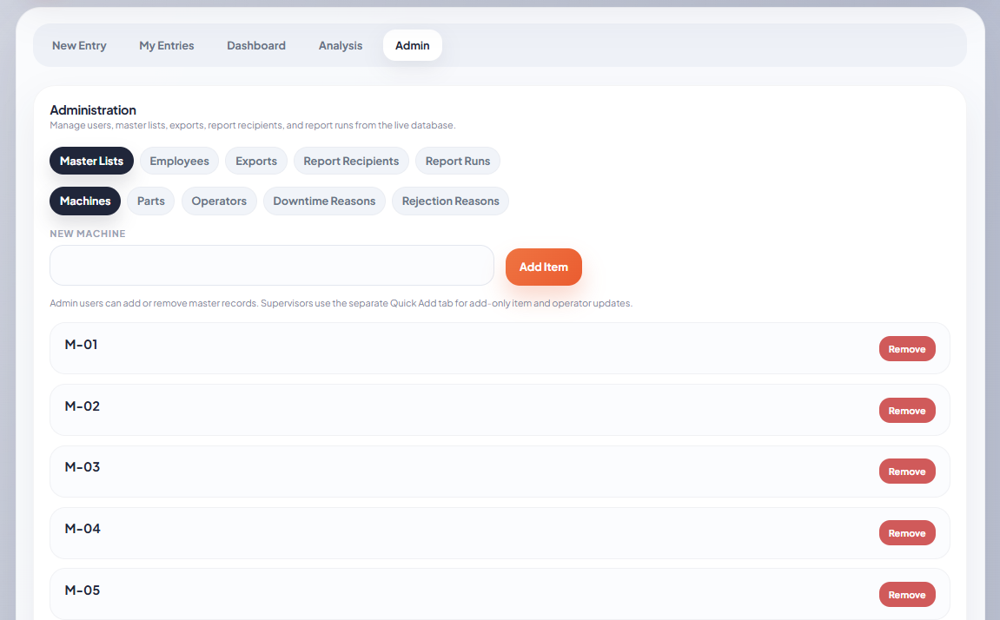

# 🏭 Production OEE Tracker
### Built for Shubhada Polymers Pvt. Ltd. — Live since Apr 2026

[](https://oee-production-dashboard1.vercel.app/)
[](https://reactjs.org)

A full-stack web application that digitised shop-floor production reporting for a manufacturing company. Supervisors enter shift data from their mobile phones; management sees live OEE, rejection trends, and machine performance in real time — replacing 2+ hours of daily paper-based reporting.

> **Status:** Live in production at Shubhada Polymers, Nashik, Maharashtra.

---

## 🔗 Live Demo

👉  **[Visit Live App](https://oee-production-dashboard1.vercel.app/)**

Try it yourself with demo credentials:

| Field | Value |
|---|---|
| Employee ID | ADM002 |
| PIN | 1234 |

> Demo runs on a separate Supabase project with anonymised sample data. No real company data is exposed.


## 📸 Screenshots

### Login — Role-based access


*Employee ID + PIN authentication. Accounts created by Admin. Three roles: Admin, Supervisor, Manager.*

### New Entry — Mobile-friendly data entry

*Supervisors fill shift details, machine, operator, qty, downtime reason from their phones on the shop floor. "Repeat last entry" feature reduces typing for recurring jobs.*

### My Entries — Entry history with live OEE

*Each entry shows Quality % inline. Rejection reasons expand from the row. Same-day edit and delete available.*

### Dashboard — Live KPI summary

*Real-time: Total Production, Overall OEE (A×P×Q), Good Output, Rejection Rate, Top Supervisor, Most Rejected Item. Filterable by date, shift, machine, supervisor, and part.*

### Analysis — Trends and Pareto charts


*Daily OEE trend, Production trend, Rejection rate trend. Downtime Pareto + Rejection Pareto with cumulative % bars. Machine/Supervisor/Part league tables with full OEE breakdown.*

### Admin Panel — Master data management

*Manage machines, parts, operators, downtime reasons, rejection reasons, employees, report recipients. Export data to CSV. Run scheduled reports.*

---

## 🔧 Tech Stack

| Layer | Technology |
|---|---|
| Frontend | React (JavaScript) |
| Backend / Database | Supabase (PostgreSQL + Auth + Realtime) |
| Hosting | Vercel |
| UI | Custom CSS (styles.js, ui.js) |
| Data Export | CSV export built-in |

---

## 📊 What it replaced

| Before | After |
|---|---|
| Paper forms collected on the shop floor | Mobile data entry from the machine itself |
| Supervisor spends 2+ hrs/day compiling reports | Reports generated instantly, always up to date |
| Manual Excel entry — typos, inconsistent data | Structured dropdowns, validated fields |
| No visibility into OEE or rejection trends | Live dashboard with Pareto analysis |
| No accountability per machine/operator | League tables ranked by OEE |

---

## 🗂 Project Structure

```
src/
├── screens/
│   ├── AuthScreens.js       # Login with Employee ID + PIN
│   ├── EntryScreen.js       # New production entry form
│   ├── HistoryScreen.js     # My entries with date filter
│   ├── DashboardScreen.js   # Live KPI cards + machine leaders
│   ├── AnalysisScreen.js    # Trends, Pareto, league tables
│   ├── AdminScreen.js       # Master lists, exports, report runs
│   └── QuickAddScreen.js    # Supervisor quick-add for parts/operators
├── App.js                   # Routing and role-based tab control
├── api.js                   # All Supabase queries
├── utils.js                 # OEE calculation logic (A × P × Q)
├── ui.js                    # Reusable UI components
└── styles.js                # Global styles

supabase/                    # DB schema and RLS policies
├── cron/
│   ├── setup_management_reports.sql
├── functions/
│   ├── employee-admin
│       ├──index.ts
│   ├── management-report
│       ├──index.ts
├── migrations/
│   ├── 20260407_phase3.sql

├──.env
├──.gitignore
├──README.md
├──package-lock.json
├──package.json
   
```

---

## ⚙️ OEE Calculation

OEE is calculated as: **Availability × Performance × Quality**

```
Availability (A) = Actual Runtime / Planned Runtime
Performance  (P) = Actual Qty / (Planned Runtime × Ideal Rate)
Quality      (Q) = Good Qty / Actual Qty

OEE = A × P × Q
```

Each production entry stores these components. The dashboard computes weighted OEE across all filtered entries in real time.

---

## 🔐 Role-Based Access

| Role | Access |
|---|---|
| **Supervisor** | New Entry, My Entries, Quick Add |
| **Manager** | Dashboard, Analysis (read-only) |
| **Admin** | All tabs + Admin panel (manage users, master data, exports) |

---

## 🚀 Key Features

- ✅ Mobile-first UI — designed for shop-floor use on phones
- ✅ Live OEE calculation — updates as entries are submitted
- ✅ Repeat last entry — reduces data entry time for recurring jobs
- ✅ Rejection detail rows — linked child records per parent entry
- ✅ Pareto analysis — downtime and rejection causes ranked by impact
- ✅ League tables — machines, supervisors, and parts ranked by OEE
- ✅ Date / shift / machine / supervisor / part filters on all views
- ✅ CSV export and scheduled report runs
- ✅ Admin-controlled master lists (machines, parts, operators, reasons)

---

## 🛠 Local Setup

```bash
# Clone the repo
git clone https://github.com/YOUR_USERNAME/production-oee-tracker.git
cd production-oee-tracker

# Install dependencies
npm install

# Configure environment
cp .env.example .env
# Add your Supabase URL and anon key to .env

# Start the app
npm start
```

**Environment variables needed (see `.env.example`):**
```
REACT_APP_SUPABASE_URL=your_supabase_project_url
REACT_APP_SUPABASE_ANON_KEY=your_supabase_anon_key
```

---

## 💡 What I learned building this

- Designing role-based UX where each user sees only what they need
- Structuring a relational database for OEE — parent entry (shift-level) with child rows (rejection reasons)
- Writing Supabase RLS (Row Level Security) policies for per-role data access
- Building Pareto analysis in JavaScript from raw production records
- Shipping and maintaining a live production app used daily by real users

---

## 👤 Author

**Piyush Ramesh Kothawade**
Data Analyst · AI Automation Specialist
[LinkedIn](https://www.linkedin.com/in/piyush-kothawade/) · [Portfolio](https://codebasics.io/portfolio/Piyush-Kothawade)

---

*This project is shared for portfolio purposes. Company-specific data has been replaced with anonymised sample data in the demo.*
